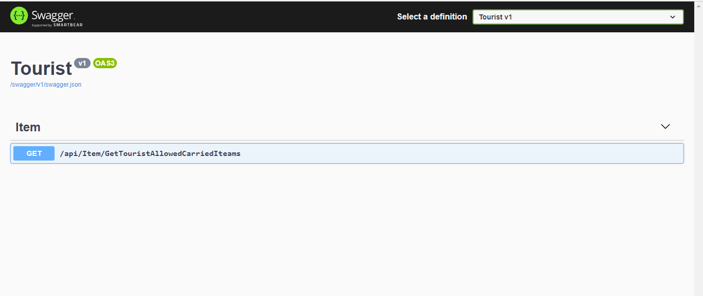
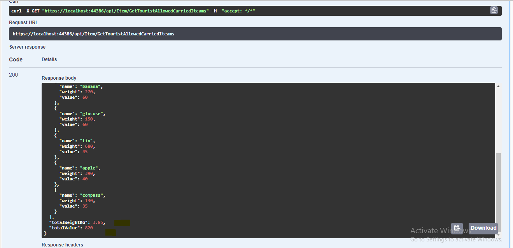
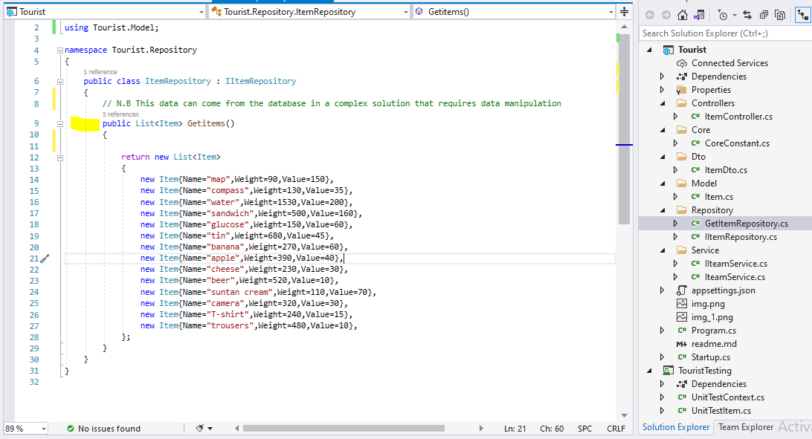

Tourist
----
Tourist highest priority Knapsack carrier

I have also included api documentation -swagger https://localhost:44386/swagger/index.html



Kindly note that i have kept it simple by only using the Get Method but the best solution would be to use POST Method that will take the List Items in a Json format payload and return list of highest priority knapsack

The Get request will return aa list of Items with the highest value and making sure that the sum of the weight does not exceed 4kg,
the response will also come with the total weight and total values. i used DTOs to accomplish this.



By following KISS Principle i didnt' add the database because there's not data manipulation on this project , i only created a repository that will supply me with the list Items(Object). I din't use Async methods in my Api controller as i don't see the need in this project since the data given is static, in  an enterprise solution an async methods would have been used to accomodate long calls



To come up with the final working solution , i had two approaches of determining the highest priority item list for the tourist,but in the solution i have used the approach with the lesser code , i have use the the below code     

```
public ItemDto MaximumkValidNapsackDetails()
        {
            var Items = itemRepository.Getitems().OrderBy(p=>p.Value).Reverse().ToList();
            foreach (var item in Items)
            {
                if (countKG + item.Weight < CoreConstant.MaximumGrams)
                {
                    knapsack.Add(item);
                    countKG += item.Weight;
                    countMaxValue += item.Value;
                }
                else
                {
                    itemsthatExceedMaxKg.Add(item);
                }

            }
            var TotalWeightKG = TotalWeight(knapsack);

            return new ItemDto { Items = knapsack, TotalWeightKG = TotalWeightKG, TotalValue = countMaxValue };
        }
  ```        

the second approach which is not included in this solution was to determine the highest value mannually using for loop and while loop. Please see the below code snipped and note that the below snipped is not part of the solution, i'm just adding it to show a diffewrent approach i would have use .

``` 
while (countKG < CoreConstant.MaximumGrams && Items.Count > 0)
            {
                Item MaxItem = GetHighestValueItem(Items);

                if (countKG + MaxItem.Weight <= CoreConstant.MaximumGrams)
                {
                    knapsack.Add(MaxItem);
                    countKG += MaxItem.Weight;
                    countMaxValue += MaxItem.Value;
                }
                else
                {
                    itemsthatExceedMaxKg.Add(MaxItem);
                }
                Items.Remove(MaxItem);

            }
            if (Items.Count > 0)
                Items = Items.Concat(itemsthatExceedMaxKg).ToList();
            else
                Items = itemsthatExceedMaxKg;
            var dr = TotalWeight(knapsack);

            return new ItemDto { Items = knapsack, TotalWeight =  countKG, TotalValue = countMaxValue };
  ```
Tourist Unit Test Project is also part of the solution. 
<br />

#Reflection questions:
1.What did you find challenging about this problem?<br />
the service , i still feel like i can refactor the service to reduce the number of code in it by introducing a new method in a DTO class or in an Item class

2.What design/development principles/patterns did you use in your solution?<br />
i have used SOLID principle,repository pattern.

3.How long did it take you to complete the solution?<br />
I didn't write the whole application at once, i wrote it bit by bit , but to finish it the whole of it took me two day after i came back from Limpopo.


##Part 2
1. After looking at Warewolf, what skills have you got that you think would help with the development of the application?<br />
I already have K2 knowledge which is also a workflow based automation system, i will bring integrating workflow with the database calling an API using SMARTOBJECTS


2. Why do you want to work on this product?<br />
Low code platform help speed up development process, it will reduce the amount of time we spend trying to develop an application.

3. What do you not like about the product?<br />

With my K2 (Workflows) knowledge , i think low code platforms are not easy to document , and sometimes complex to troubleshoot.

##Thank You!!!.
